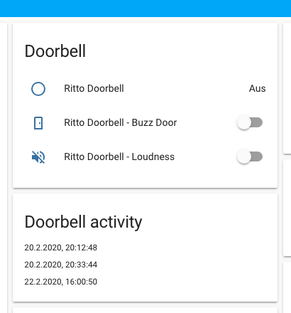
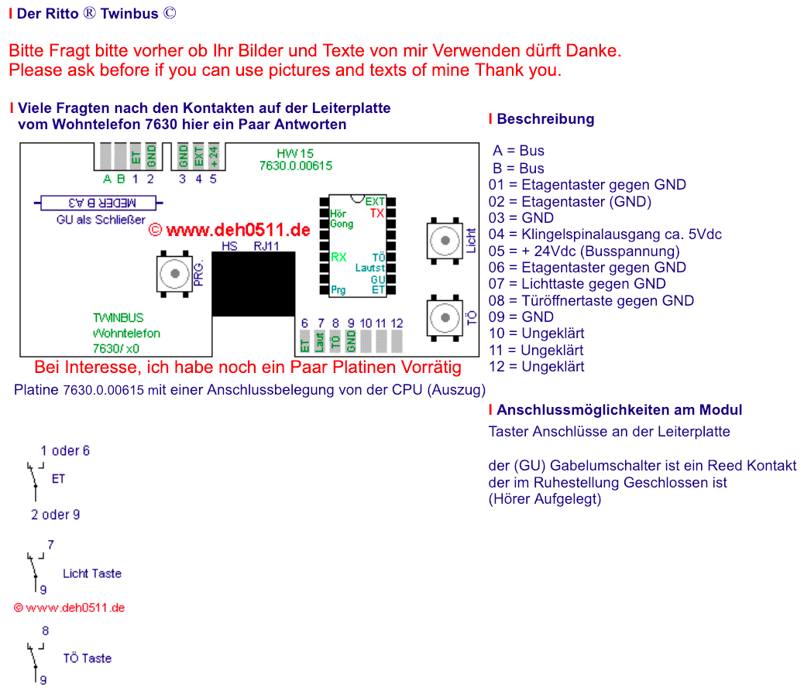
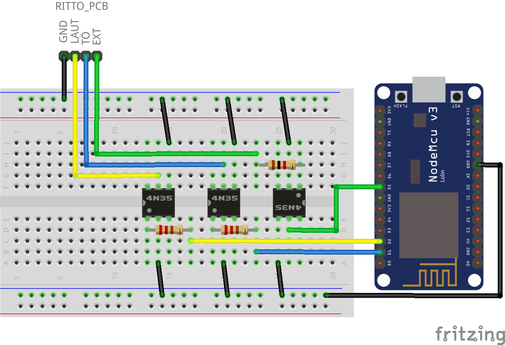
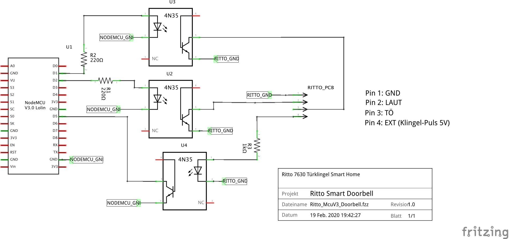

# Ritto smart home doorbell

Ritto 7360 Doorbell (Wohntelefon) instructions (incl. Home Assistant lovelace integration)



## Hardware

### Assembly list
| Amount |  Part type     | Properties | Labels     | Remarks                            |
| ------ | -------------- | ---------- | ---------- | ---------------------------------- |
|     1x | ESP8266 module |    -       | U1         | Any other ESP8266 can be used too  |
|     3x | Optocoupler    | 4N35       | U2, U3, U4 |                                    |
|     2x | Resistor       | 220 Ohm    | R1, R2     |                                    |
|     1x | Resistor       | 1 kOhm     | R3         |                                    |

### Pinout
```
D1 GPIO05 -> Relais1 - Relais Door opener (TÖ -> GND)
D2 GPIO04 -> Relais2 - Relais Mute (LAUT -> GND)
D5 GPIO14 -> Switch3 - Button Signal (EXT +5V Ring pulse)
```

### Diagrams





Breadboard setup



Schematics

## Software

### Tasmota Module Template
```json
{"NAME":"DoorbellMcuV3","GPIO":[17,148,56,149,22,21,255,255,255,255,11,255,255],"FLAG":15,"BASE":18}
```

### Tasmota
1. Flash [TASMOTA](https://tasmota.github.io/docs/#/) software onto the ESP8266 module
2. Configure with (serial-)console commands
3. Connect everything together
4. Profit!

#### Setup
```
# General setup
Backlog ssid <WIFI_SSID>; password <WIFI_PASSWD>;
Backlog mqtthost <MQTT_HOST>; mqttuser <MQTT_USER>; mqttpassword <MQTT_PASSWORD>; MqttClient DoorBell; topic doorbell;
Backlog Hostname RittoDoorbell; FriendlyName DoorBell;

# Power off both relais/optocouplers after 0.5 seconds 
PulseTime1 5
PulseTime2 5

# Set a switch topic where ring is announced
SwitchTopic3 ring_sensor

# SwitchMode - falling-edge
SwitchMode3 3

# Set up module template
Template <JSON_MODULE_TEMPLATE>
# Activate template
Module 0
```

### MQTT

The following commands can be used to control the doorbell or gets its status

Doorbell ring status is emmited like this:
```
cmnd/ring_sensor/POWER3 -> TOGGLE
# e.g. mosquitto_sub -t cmnd/ring_sensor/POWER3
```

To toggle OPEN DOOR (Türöffner) button
```
cmnd/doorbell/POWER1 TOGGLE
# e.g. mosquitto_pub -t cmnd/doorbell/POWER1 -m TOGGLE
```


To toggle LOUD (LAUT) button
```
cmnd/doorbell/POWER2 TOGGLE
# e.g. mosquitto_pub -t cmnd/doorbell/POWER2 -m TOGGLE
```

## Credits
[beechy.de](https://beechy.de/smart-doorbell/)

[robinhenniges.com](https://robinhenniges.com/diy-smart-door-fuer-5-euro-smart-door-opener-part-1/)

[nicht-trivial.de](https://www.nicht-trivial.de/index.php/2018/02/14/ritto-zu-mqtt/)

[deh0511.de](http://www.deh0511.de/twinbus/)

[Tasmota](https://tasmota.github.io/docs/#/)
